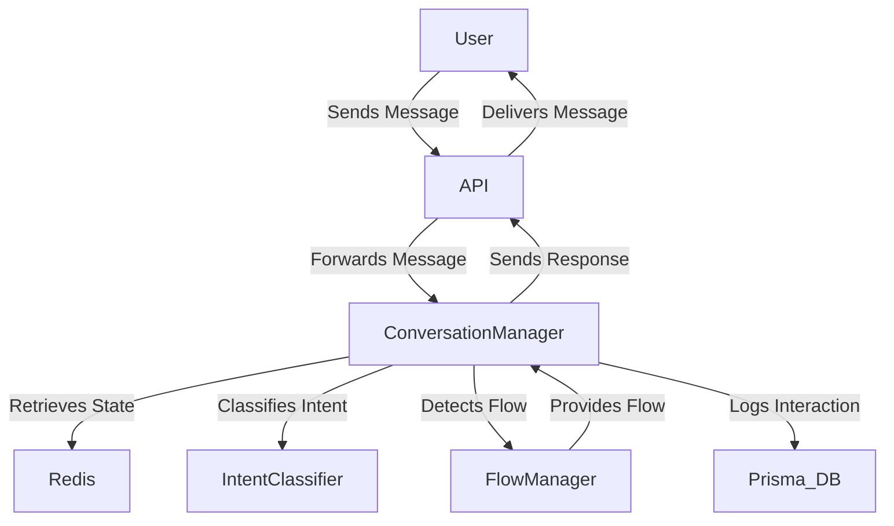

# Chatbot Project Design Document

## Table of Contents

1. [Introduction](#1-introduction)
2. [Project Overview](#2-project-overview)
3. [System Architecture](#3-system-architecture)
4. [Component Design](#4-component-design)
   - [4.1. FlowManager](#41-flowmanager)
   - [4.2. ConversationManager](#42-conversationmanager)
   - [4.3. Data Storage](#44-data-storage)
   - [4.4. YAML Flow Specification](#45-yaml-flow-specification)
5. [Data Flow Diagrams](#5-data-flow-diagrams)
6. [Testing Strategy](#6-testing-strategy)

---

## 1. Introduction

### 1.1. Purpose

This design document outlines the architecture, components, and workflows for the development chatbot project. The chatbot is designed to handle user interactions efficiently, providing accurate responses based on predefined flows and intents.

### 1.2. Scope

The document covers the following aspects:

- Detailed component design
- Data flow and interactions
- API specifications
- Security measures
- Scalability considerations
- Testing strategies

---

## 2. Project Overview

- **Intent-Based Flow Detection:** Understand user intentions beyond keyword matching.
- **YAML Flow Specifications:** Define conversation flows in an organized and maintainable format.
- **Branch-Only Steps:** Implement internal logic without sending messages to users.
- **Context Management:** Maintain conversation context for personalized interactions.
- **Scalability:** Handle increasing user interactions efficiently.

---

## 3. System Architecture

### 3.1. Components

1. **ConversationManager:** Manages the state of each user conversation, processes messages, and determines responses.
2. **FlowManager:** Loads and manages YAML-based flow specifications, detects flows based on triggers or intents.
3. **IntentClassifier:** Analyzes user messages to classify intents using predefined logic or AI models.
4. **Data Storage:**
   - **Redis:** Stores user conversation states for quick access and real-time updates.
   - **Prisma with Database:** Logs interactions and manages persistent data.
5. **AI Services:** Optional integration with external AI or NLP services for advanced processing.

---

## 4. Component Design

### 4.1. FlowManager

**Purpose:**
The `FlowManager` is responsible for loading, categorizing, and managing conversation flows defined in YAML files. It detects appropriate flows based on trigger keywords or classified intents.

**Key Responsibilities:**

- Load YAML flow specifications from the designated directory.
- Categorize flows into keyword-based and intent-based.
- Detect and retrieve flows based on user input.

**Design Considerations:**

- **Maintainability:** Support easy updates and additions to flows.

### 4.2. ConversationManager

**Purpose:**
The `ConversationManager` handles the lifecycle of user conversations. It processes incoming messages, manages user states, interacts with the `FlowManager` and `IntentClassifier`, and determines the appropriate responses.

**Key Responsibilities:**

- Manage user conversation states using Redis.
- Process user messages and determine responses.
- Interface with `FlowManager` to detect and navigate flows.
- Utilize `IntentClassifier` for intent-based flow detection.
- Log interactions using Prisma for persistence.

**Design Considerations:**

- **State Management:** Ensure accurate tracking of conversation states for each user.
- **Concurrency:** Handle multiple user interactions simultaneously without state conflicts.
- **Extensibility:** Allow easy integration of additional features or components.

### 4.3. Data Storage

**Purpose:**
Efficient data storage is critical for managing user conversation states and logging interactions for analysis and improvement.

**Components:**

1. **Redis:**
   - **Usage:** Stores transient user conversation states for quick retrieval and real-time updates.
   - **Benefits:** In-memory storage ensures low latency access, ideal for session management.

2. **Prisma with Database:**
   - **Usage:** Logs user interactions, including messages, responses, and context data for persistence and analysis.
   - **Benefits:** Provides a robust ORM for managing database operations with type safety and ease of use.

**Design Considerations:**

- **Data Consistency:** Ensure synchronization between Redis and the database to prevent state discrepancies.
- **Scalability:** Choose database solutions that can scale with increasing data volumes.
- **Security:** Protect stored data against unauthorized access and breaches.

### 4.4. YAML Flow Specification

**Purpose:**
The YAML flow specification defines the conversation flows, including triggers, steps, and branching logic. It provides a human-readable and maintainable way to design and update chatbot interactions.

**Key Features:**

- **Trigger Keywords:** Define keywords that activate specific flows.
- **Steps:** Outline the sequence of actions or messages in a flow.
- **Branch-Only Steps:** Implement internal logic without sending messages to users.
- **Context Management:** Update and utilize conversation context variables.

---

## 5. Data Flow Diagrams

### 5.1. High-Level Data Flow

**Explanation:**

1. **User Interaction:** The user sends a message via the UI.
2. **API Gateway:** Receives the message and forwards it to the `ConversationManager`.
3. **ConversationManager:**
   - Retrieves the user's conversation state from Redis.
   - Uses `IntentClassifier` to determine the user's intent.
   - Detects the appropriate flow using `FlowManager`.
   - Determines the next step and formulates a response.
4. **FlowManager:** Provides the relevant flow based on triggers or intents.
5. **Response Delivery:** The `ConversationManager` sends the response back through the `API Gateway` to the user.
6. **Logging:** All interactions are logged into the database via Prisma for analysis and record-keeping.

---

## 6. Testing Strategy

### 6.1. Unit Testing

- **Objective:** Test individual components (e.g., `FlowManager`, `ConversationManager`) to ensure they function as intended.
- **Tools:** Jest

### 6.2. Integration Testing

- **Objective:** Test interactions between different components to verify seamless integration.
- **Tools:** Supertest